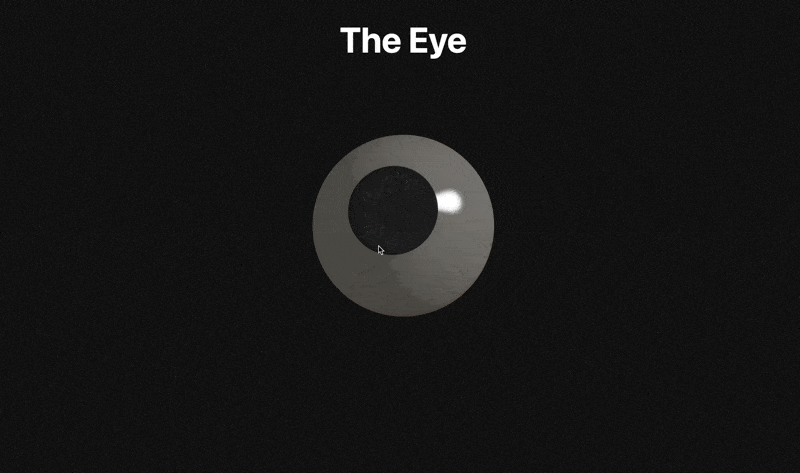

# Simple Eye using ThreeJS, React Three Fiber, and Framer Motion

# 3D JS Test

This project is a test environment for experimenting with 3D graphics using JavaScript.

## Technologies Used

- **Three.js**:
- **React Three Fiber**: 
- **Framer Motion**:
- **Vite**: 

## Mouse Tracking
The eye follows the mouse cursor using useSpring and useMotionValue from Framer Motion. These hooks create smooth animations for the eye's rotation based on the mouse position.

## Grainy Background
The grainy background effect is achieved using a custom shader. The shader is applied to a large plane positioned behind the eye model.

